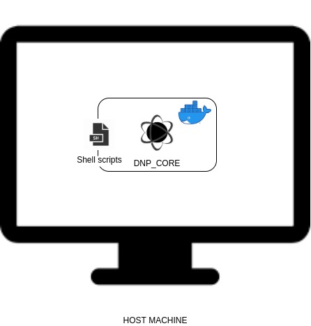

# DNP CORE

This package contains other core packages versions, so if something went wrong in a new release of the DAPPMANAGER, this package has the capability to solve these kind of problems.

Its main objective is to run shell scripts to improve and patch possible errors. This scripts may modify or not some parameters of the host machine. It uses a docker option to run shell commands in root mode.

